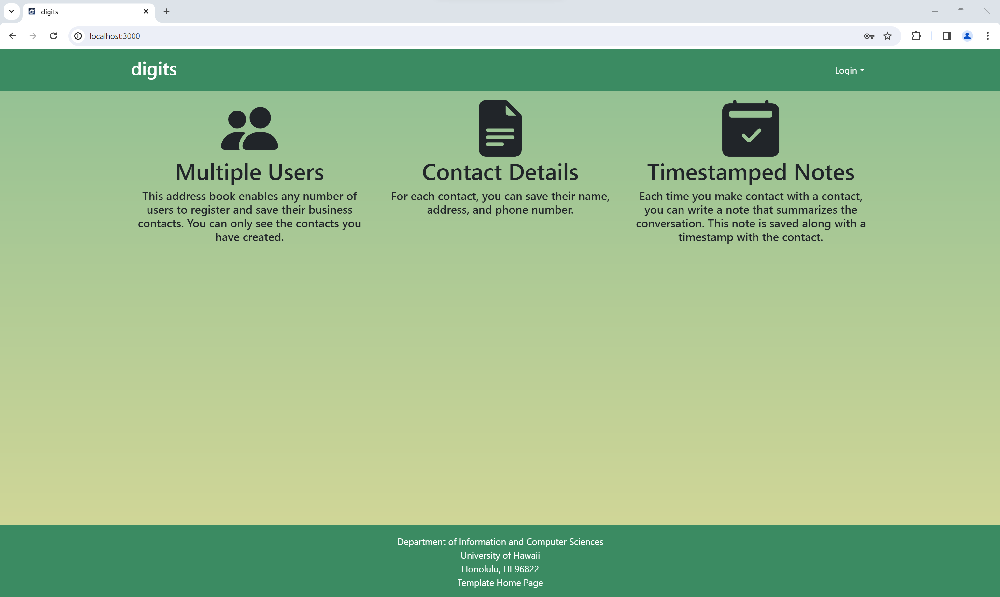
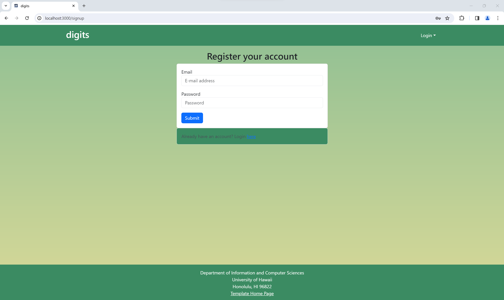
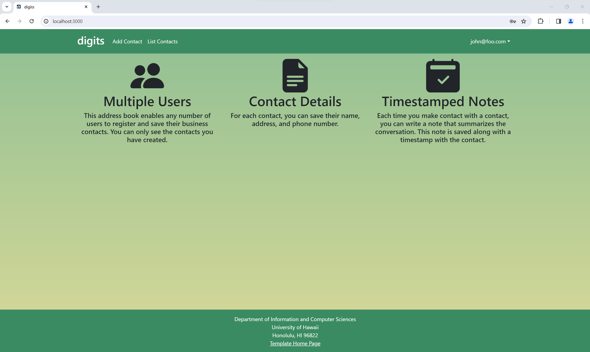
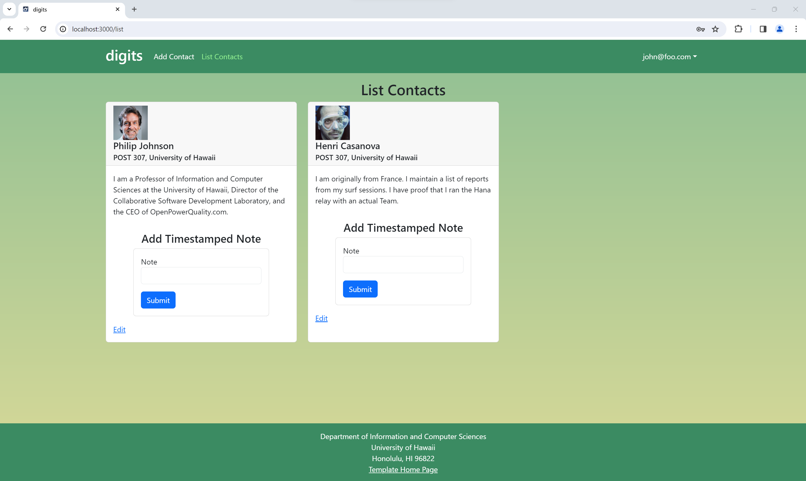
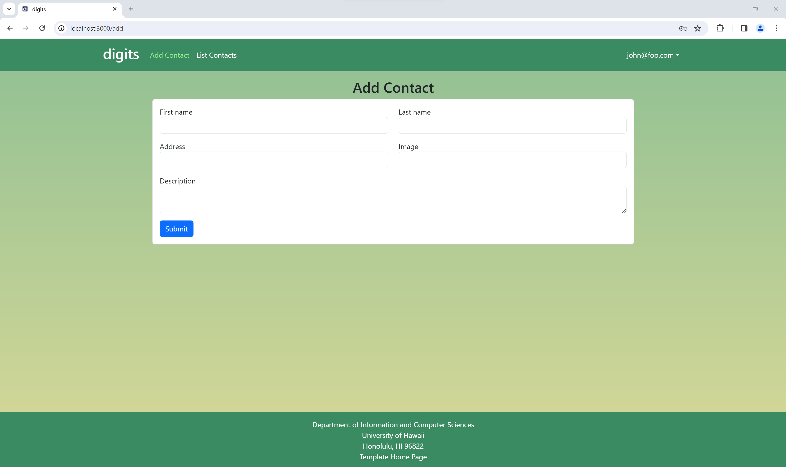
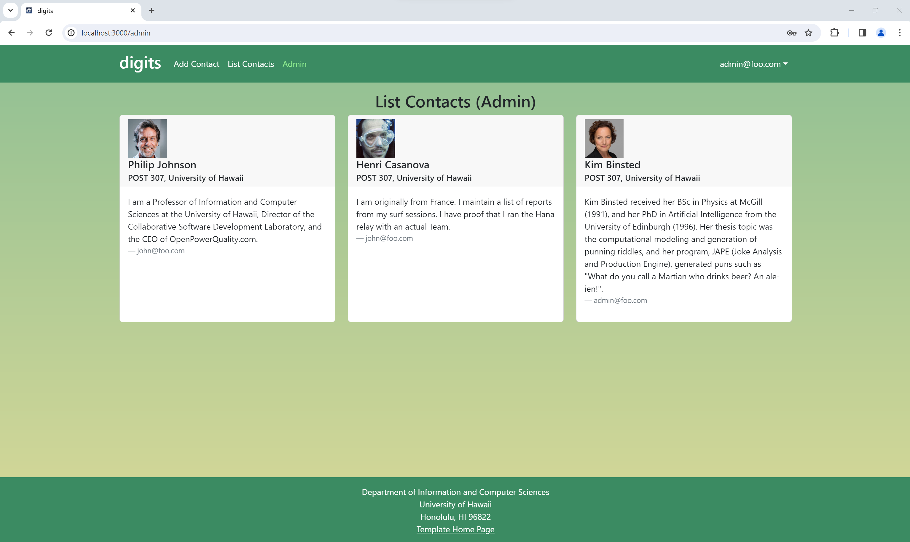

# Digits



Digits allows users to:

- Create an account.
- Manage their contacts.
- Add timestamped notes about meetings with their contacts.

## Installation

1. [Install Meteor](https://docs.meteor.com/install.html).

2. [Download a copy of Digits](https://github.com/em846/digits).

3. cd into the app directory and install the required libraries with:
```
$ meteor npm install
```
4. When installation is done, you can run the application by invoking:
```
$ meteor npm run start
```
When the application is run for the first time, it will create default users and data. Here is an example of what the output looks like:
```
meteor npm run start

> meteor-application-template-react@ start C:\Users\E\Documents\GitHub\digits\app
> meteor --no-release-check --exclude-archs web.browser.legacy,web.cordova --settings ../config/settings.development.json

[[[[[ C:\Users\E\Documents\GitHub\digits\app ]]]]]

=> Started proxy.
=> Started HMR server.
=> Started MongoDB.
I20231104-21:46:20.661(-10)? Creating the default user(s)
I20231104-21:46:20.674(-10)?   Creating user admin@foo.com.
I20231104-21:46:20.880(-10)?   Creating user john@foo.com.
I20231104-21:46:20.987(-10)? Creating default data.
I20231104-21:46:20.987(-10)?   Adding: Johnson (john@foo.com)
I20231104-21:46:21.009(-10)?   Adding: Casanova (john@foo.com)
I20231104-21:46:21.011(-10)?   Adding: Binsted (admin@foo.com)
=> Started your app.

=> App running at: http://localhost:3000/
   Type Control-C twice to stop.
```

The app should now be running at [http://localhost:3000](http://localhost:3000). You may login to the default accounts created using the credentials found in [settings.development.json](https://github.com/ics-software-engineering/meteor-application-template-react/blob/main/config/settings.development.json) or create a new account.

5. You may also exit Meteor and run ESLint over code in the /imports directory by invoking:
```
meteor npm run lint
```

### User Interface Walkthrough

#### Landing Page

When first opening the application, the first page to load should be the landing page, which shows an overview of what Digits can be used for.


#### Sign up

Users can create an account through the sign up page, which is located in the login dropdown menu in the top right.



#### Sign in

If you already have an account, you can login through the sign in page also located in the login dropdown menu.


#### User Home Page

Upon logging in, you will be taken to the home page which appears like the landing page except with extra pages in the navbar at the top.



#### List Contacts Page

Users can view the contacts they have added to their profile here. They have the option to add notes that will be timestamped to the contact, detailing a meeting they have had with that contact. Users can also edit the contact through the Edit link at the bottom of each contact.



#### Add Contacts Page

Users can add contacts to their profile as they wish through this page. All fields are required to be filled out.



#### Admin

Users can have the admin role. This adds an additional page where this user can view all contacts on all profiles.

